# Rendered PlantUML Diagrams

> Auto-generated by GitHub Actions from `.puml` / `.plantuml` files.

## Index

- [C4L1](#c4l1)
- [C4L3-DataTier](#c4l3-datatier)
- [C4L3-Presentation](#c4l3-presentation)
- [C4_Container_KleffHosting](#c4-container-kleffhosting)
- [Deployment](#deployment)
- [IdentityAndAccess](#identityandaccess)
- [Kleff Developer Deployment](#kleff-developer-deployment)
- [Kleff Hosting - Billing Use Cases](#kleff-hosting-billing-use-cases)
- [Kleff Hosting - Observability Use Cases](#kleff-hosting-observability-use-cases)
- [Kleff Hosting - Platform Admin Use Cases](#kleff-hosting-platform-admin-use-cases)
- [Kleff Hosting C4L3 - Billing](#kleff-hosting-c4l3-billing)
- [Kleff Hosting C4L3 - Deployment](#kleff-hosting-c4l3-deployment)
- [Kleff Hosting C4L3 - Identity & Access](#kleff-hosting-c4l3-identity-access)
- [Kleff Hosting C4L3 - Observability](#kleff-hosting-c4l3-observability)
- [Kleff Hosting C4L3 - Project Management](#kleff-hosting-c4l3-project-management)
- [Kleff Hosting DDD](#kleff-hosting-ddd)
- [ProjectManagement](#projectmanagement)
- [UC01-DLCD](#uc01-dlcd)
- [UC01-DLSD](#uc01-dlsd)
- [UC01-SSD](#uc01-ssd)
- [UC01-STD](#uc01-std)
- [UC10-DLCD](#uc10-dlcd)
- [UC10-DLSD](#uc10-dlsd)
- [UC10-SSD](#uc10-ssd)
- [UC10-STD](#uc10-std)
- [WorkspaceManagement](#workspacemanagement)

---

## Diagrams

### C4L1

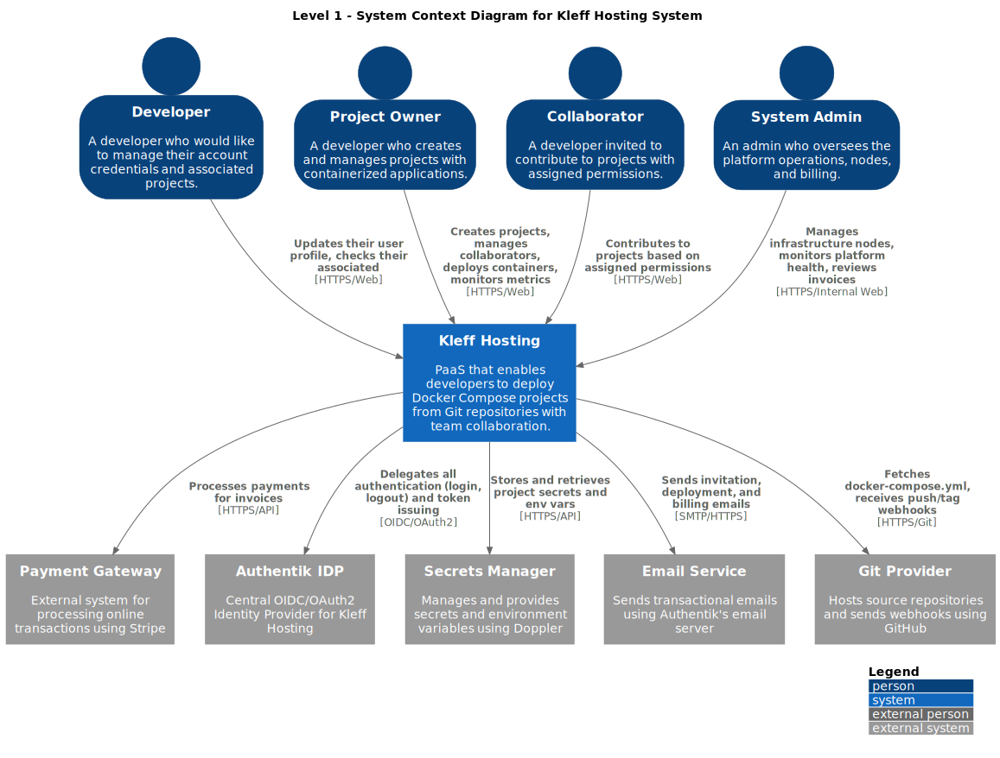

### C4L3-DataTier

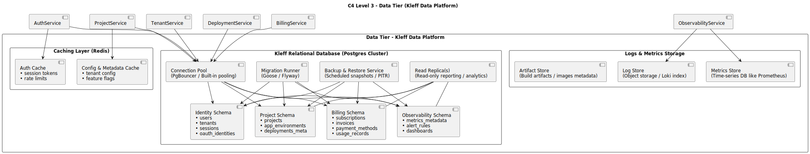

### C4L3-Presentation

### C4_Container_KleffHosting

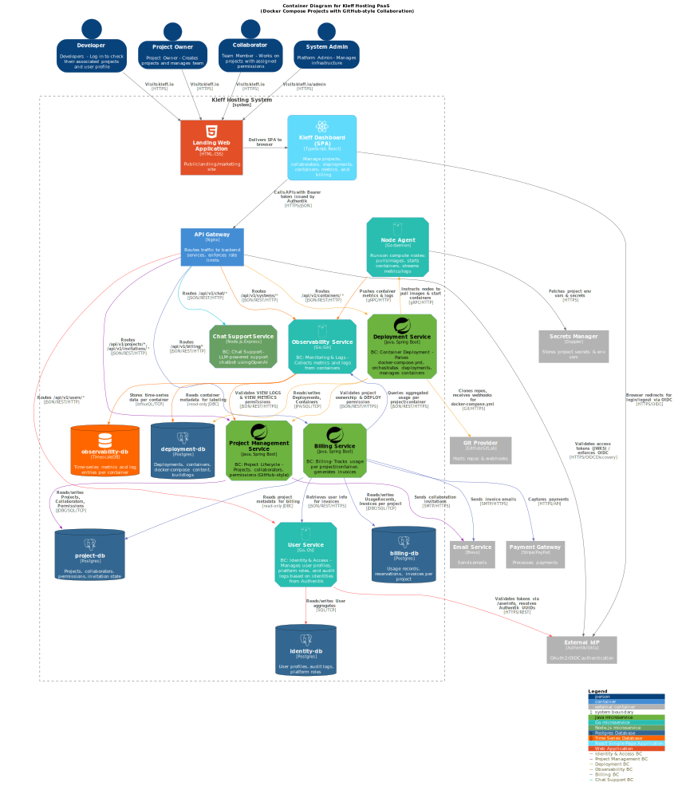

### Deployment

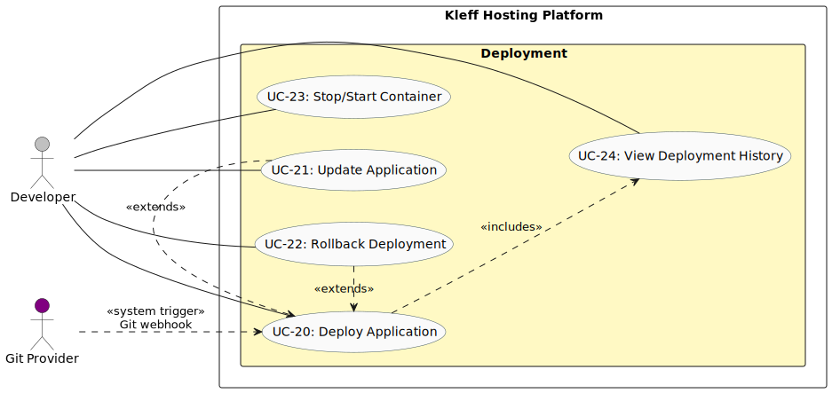

### IdentityAndAccess

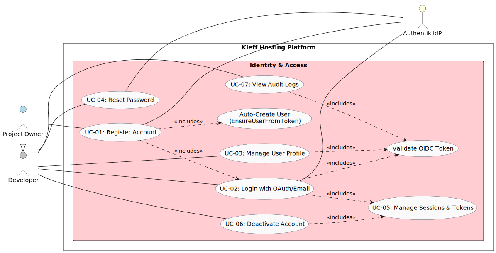

### Kleff Developer Deployment

### Kleff Hosting - Billing Use Cases

### Kleff Hosting - Observability Use Cases

### Kleff Hosting - Platform Admin Use Cases

### Kleff Hosting C4L3 - Billing

### Kleff Hosting C4L3 - Deployment

### Kleff Hosting C4L3 - Identity & Access

### Kleff Hosting C4L3 - Observability

### Kleff Hosting C4L3 - Project Management

### Kleff Hosting DDD

### ProjectManagement

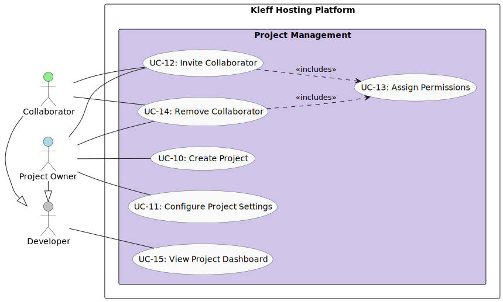

### UC01-DLCD

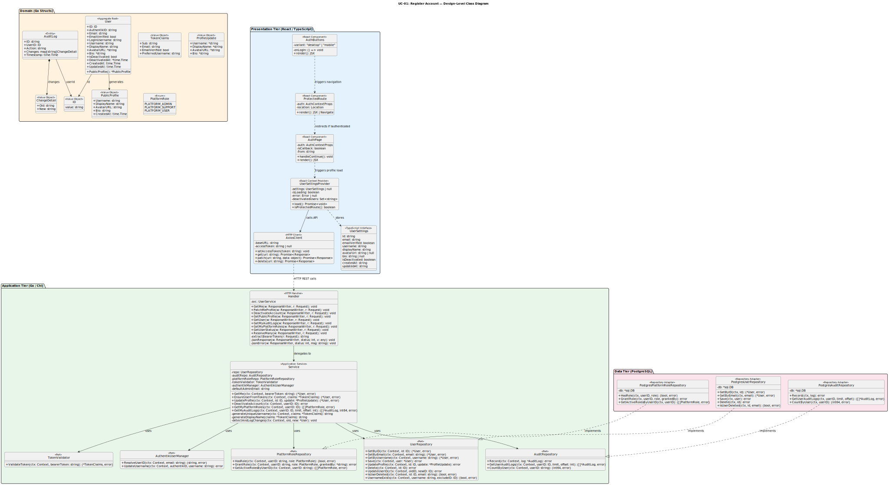

### UC01-DLSD

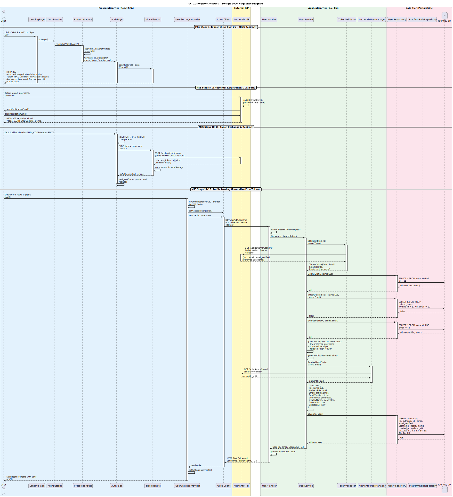

### UC01-SSD

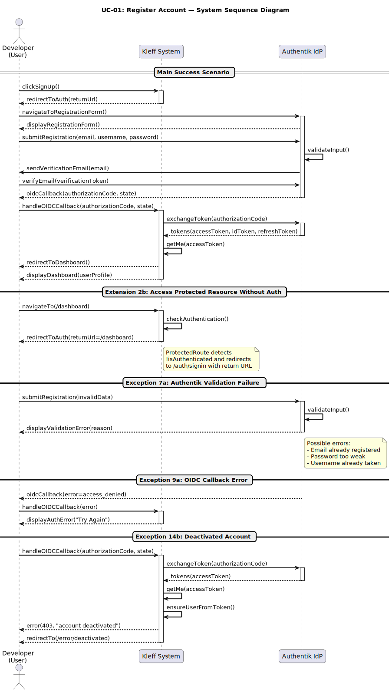

### UC01-STD

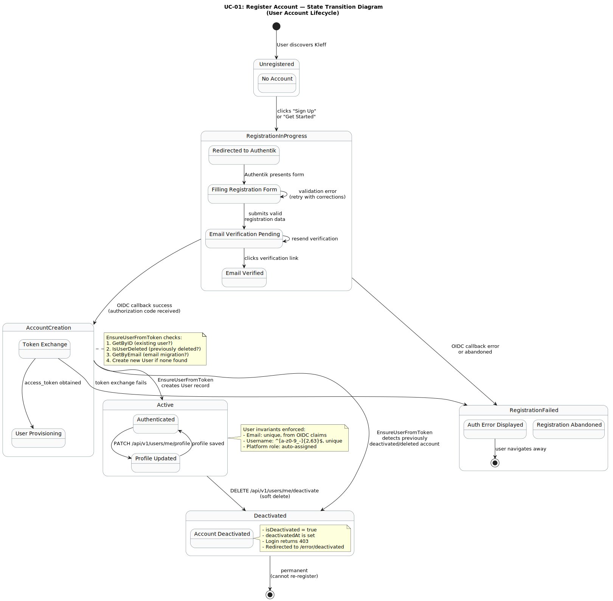

### UC10-DLCD

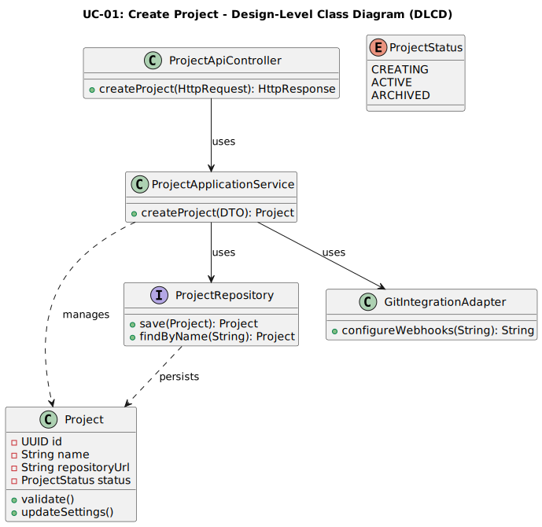

### UC10-DLSD

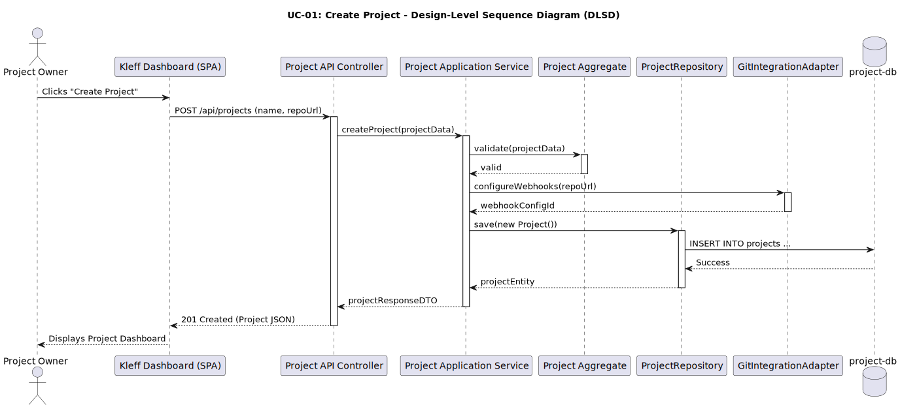

### UC10-SSD

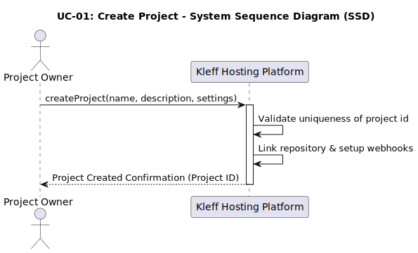

### UC10-STD

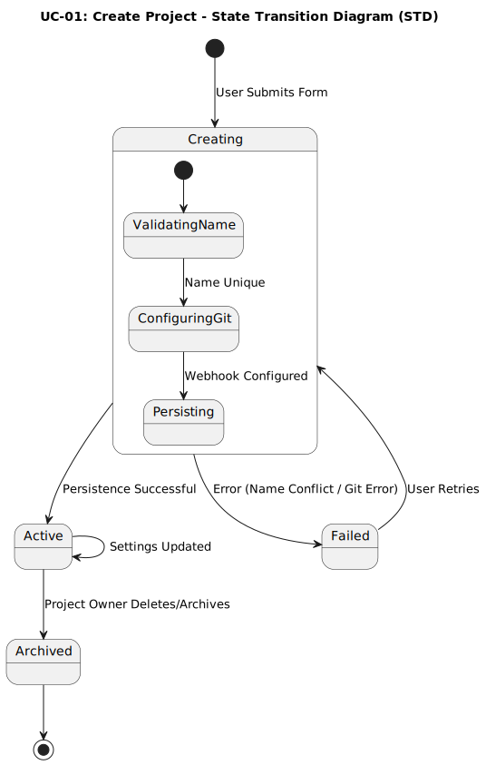

### WorkspaceManagement

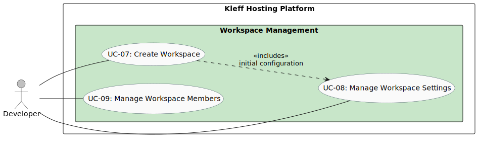

